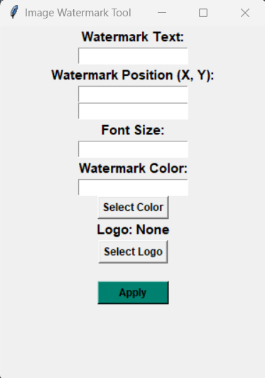

# Introduction
   Watermarking Desktop App is a desktop program where you can upload images and add a watermark. 
  
  Input is applicable as following formats:  ' .jpg ',  ' .jpeg ',  ' .png ',  ' .gif ',  ' .bmp '.    
  
  Output is saved as a '.png ' file.

  

  ## Features
  - **Python**
  - **Tkinter** to **upload file** and **choose color** of watermark.
  - **PIL** to processing image.
